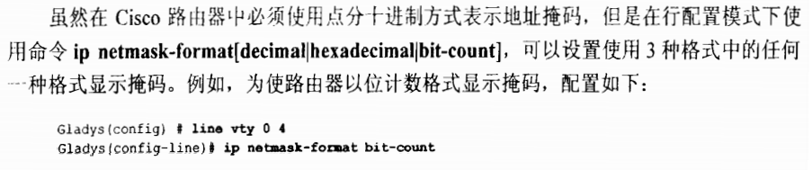

# 传输层：

端口号范围：0-65535	|	1-1023静态端口	|	1024-65534随机端口

三次握手：

```python
'''
PCA---------->PCB
    1、PCA-----》PCB   syn=1 seq=j PCA-》SYN_SENT
    2、PCA《-----PCB	 syn=1 seq=k ack=j+1 PCB-》SYN_RECV
    3、PCA-----》PCB   ack=k+1 PCA、PCB-》ESTABLISHED
'''
```

四次分手：

```python
'''
PCA---------->PCB
    1、PCA-----》PCB   fin=1 seq=j
    2、PCA《-----PCB	 ack=j+1
    3、PCA《-----PCB	 fin=1 seq=k 
    3、PCA-----》PCB   ack=k+1
    由于TCP存在捎带确认机制，故在实际抓包过程中经常看到三次分手，而非四次而分手。三次分手是将第二次和第三次的报文合并组成的：
    2、PCA《-----PCB	 fin=1 seq=k ack=j+1
'''
```

TCP、UDP详解（留坑待填）

# 网络层：

## IPV4（RFC 791）:

​	报文头部

```
    |---4---|---4---|------8------|--3--|--------13----------|
    |version|  IHL	| 	  TOS 	  |  	   total Length      |
    |		Identification		  |Flags|	Fragment Offset	 |
    |TTL			|	Protocol  |		Header Checksum		 |
    |						Source Address					 |
    |					  Destination Address				 |
    |				IP Option					|	Padding  |
    |--------------------------------------------------------|

    ip header max-size = 60 Byte(Option max-size 40 Byte)
    ip header min-size = 20 Byte(no Option)

	(RFC791 示例)
    0                   1                   2                   3
    0 1 2 3 4 5 6 7 8 9 0 1 2 3 4 5 6 7 8 9 0 1 2 3 4 5 6 7 8 9 0 1
   +-+-+-+-+-+-+-+-+-+-+-+-+-+-+-+-+-+-+-+-+-+-+-+-+-+-+-+-+-+-+-+-+
   |Version|  IHL  |Type of Service|          Total Length         |
   +-+-+-+-+-+-+-+-+-+-+-+-+-+-+-+-+-+-+-+-+-+-+-+-+-+-+-+-+-+-+-+-+
   |         Identification        |Flags|      Fragment Offset    |
   +-+-+-+-+-+-+-+-+-+-+-+-+-+-+-+-+-+-+-+-+-+-+-+-+-+-+-+-+-+-+-+-+
   |  Time to Live |    Protocol   |         Header Checksum       |
   +-+-+-+-+-+-+-+-+-+-+-+-+-+-+-+-+-+-+-+-+-+-+-+-+-+-+-+-+-+-+-+-+
   |                       Source Address                          |
   +-+-+-+-+-+-+-+-+-+-+-+-+-+-+-+-+-+-+-+-+-+-+-+-+-+-+-+-+-+-+-+-+
   |                    Destination Address                        |
   +-+-+-+-+-+-+-+-+-+-+-+-+-+-+-+-+-+-+-+-+-+-+-+-+-+-+-+-+-+-+-+-+
   |                    Options                    |    Padding    |
   +-+-+-+-+-+-+-+-+-+-+-+-+-+-+-+-+-+-+-+-+-+-+-+-+-+-+-+-+-+-+-+-+
   

1、version(4bit)								---报文版本
	----IPV4=0b0100 | IPV6=0b0110
    
2、IHL(IP Header Length | 4bit)				---ip报头部长度
	----以4 Byte为单位，最大0b1111(15)，故IPV4报文最大长度60 Byte
    
3、TOS(Type Of Service | 8bit)				---服务类型
	----用于实施QOS,可参考RFC 1340、RFC 1349
    	RFC 791中优先级被定义为八个等级，值越大优先级越高
    	RFC 2474中优先级被重新定义，前6位定义为DSCP，可表示64种等级,后两位保留
        
4、Identification(16bit)						---标识符
	----用来标记分段后的报文,
    	主机每发送一个报文,标识符加一
        一个报文被分段,则分段得到的新报文标识符相同
        
5、Flags(3bit)								---标记
	----第一位不用
    	第二位DF位(Don't Fragment)表示是否分片 0分片 1不分片
        第三位MF位(More Fragment)表示报文是否为最后一片 0是 1否
        
6、Fragment Offset(13bit)					---分段偏移值
	----以8 Byte为单位,最大表示65535 Byte
		用于指明起始点对应于报头的偏移值,用于在接收端接收到数据包后进行重组(当所有分段到达时才进行重组)
		若传输过程中出现分段丢失,则在丢失点对数据包进行重组/分段/转发
		
7、TTL(time to live | 8bit)					---生存时间
	----每经过一台路由器会将TTL-1
        TTL=0时报文被丢弃,并回复ICMP time exceeded消息
        此字段用来防止环路
        Tracert工具采用TTL字段实现追踪功能
               
8、Protocol(8bit)							---协议
	----描述上层(传输层)所使用的的协议(TCP/UDP)
               
9、Header Checksum(16bit)					---头部校验和
	----只校验数据包的首部,不校验数据包的数据部分
               
10、Options(不定长)							  ---选项字段
    ----可选项主要用于测试
```

| 版本号 |   版本   | RFC  |
| :----: | :------: | :--: |
|   0    |   保留   |      |
|  1-3   |  未分配  |      |
|   4    |   IPV4   | 791  |
|   5    | ST数据报 | 1190 |
|   6    |   SIP    |      |
|   6    |   IPV6   | 1883 |
|   7    |  TP/IX   | 1475 |
|   8    |   PIP    | 1621 |
|   9    |   TUBA   | 1347 |
| 10-14  |  未分配  |      |
|   15   |   保留   |      |

```python
TOS详解:
(RFC791)
      Bits 0-2:  Precedence(优先权).
      Bit    3:  0 = Normal Delay,      1 = Low Delay.
      Bit    4:  0 = Normal Throughput, 1 = High Throughput.
      Bit    5:  0 = Normal Relibility, 1 = High Relibility.
      Bit    6:  0 = Normal Cost,	    1 = High Cost.
      Bit    7:  Reserved for Future Use.
      Bits 3-6:	 只有其中一比特可以为1
         0     1     2     3     4     5     6     7
      +-----+-----+-----+-----+-----+-----+-----+-----+
      |                 |     |     |     |     |     |
      |   PRECEDENCE    |  D  |  T  |  R  |  0  |  0  |
      |                 |     |     |     |     |     |
      +-----+-----+-----+-----+-----+-----+-----+-----+
    Precedence:
          111 - Network Control			-网络控制
          110 - Internetwork Control	-互联网络控制
          101 - CRITIC/ECP				-紧急
          100 - Flash Override			-快速
          011 - Flash					-迅速
          010 - Immediate				-立即
          001 - Priority				-优先
          000 - Routine					-普通
(RFC2474)

        0   1   2   3   4   5   6   7
      +---+---+---+---+---+---+---+---+
      |         DSCP          |  CU   |
      +---+---+---+---+---+---+---+---+

        DSCP: differentiated services code point
        CU:   currently unused
        ECN:  Explicit Congestion Notification
        PHB:  Per-Hop Behavior
            
```


| 协议号 |    上层协议    |
| :----: | :------------: |
|   1    | ICMP(消息控制) |
|   2    |   IGMP(组播)   |
|   4    |       IP       |
|   6    |      TCP       |
|   17   |      UDP       |
|   47   |      GRE       |
|   54   |      NHRP      |
|   88   |      IGRP      |
|   89   |      OSPF      |

```python
IP Header Checksum计算方法:
	假设报头为 E3 4F 23 96 44 27 99 F3
	1、以16bit为单位两两相加---E34F+2396+4427+99F3=1E4FF
	2、若结果大于0xFFFF 则将高16位加至低16位---0xE4FF+0x0001=E500
	3、对结果取反---(~E500)=1AFF
接收端校验方法:
	1、2步同上
	3、将结果与校验和相加,若为FFFF则数据包正常
```

```python
Option详解:
    松散源路由选择:给出一连串的路由器接口IP地址序列,数据传输时必须经过IP序列中的节点(中间可以跳过多个路由器)
    严格源路由选择:给出一连串路由器接口IP地址,数据传输必须严格按照地址序列,若下一跳不可达,则传输错误
    记录路由:当数据包离开路由器时,记录出接口IP(不同于追踪,此功能记录双向路径IP)
    时间戳:记录数据包到达路由器的时间
```

```
扩展ping命令使用:

```

```
地址:
	32位bit,由于直接书写十分麻烦,也不容易读.故采用点的十进制进行书写和阅读.(注意路由器是以32位二进制进行存储的)
	下标为IP地址分类表
	注：
```

|        规则及分类         | 前八位值  | 地址范围 | 掩码位数 |
| :-----------------------: | :-------: | :------: | :------: |
|      A类:第一位恒为0      | 0000 0000 |  0-127   |    8     |
|   B类:第一、二位恒为10    | 1000 0000 | 128-191  |    16    |
| C类:第一、二、三位恒为110 | 1100 0000 | 192-223  |    24    |
|                           |           |          |          |
|                           |           |          |          |
|                           |           |          |          |



## IPV6:

​	报文头部

# 数据链路层：

# 物理层：