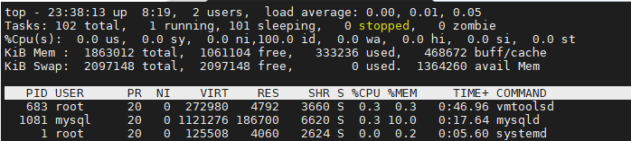

# 时间管理

## date

```shell
date "+%Y-%m"
#用于显示或设置系统时间与日期
#在date命令后输入以"+"开头的参数即可以固定的格式输出系统的时间和日期
```

| 参数 |       作用       |
| :--: | :--------------: |
|  %S  |        秒        |
|  %M  |        分        |
|  %H  | 时(二十四小时制) |
|  %I  |  时(十二小时制)  |
|  %p  |   显示(AM/PM)    |
|  %a  |   缩写的工作日   |
|  %A  |   完整的工作日   |
|  %d  |   本月中第几天   |
|  %j  |   今年中第几天   |
|  %m  |       月份       |
|  %b  |    缩写的月份    |
|  %B  |    完整的月份    |
|  %q  |       季度       |
|  %y  |     简写年份     |
|  %Y  |     完整年份     |
|  %n  |      换行符      |
|  %t  |      退格键      |

## timedatectl

```shell
#（time date control）用于设置系统时间
#示例用法：（更改时区）
timedatectl set-timezone Asia/Shanghai
```

|      参数      |     作用     |
| :------------: | :----------: |
|     status     | 显示状态信息 |
| list-timezones |   列出时区   |
|    set-time    |   设置时间   |
|  set-timezone  |   设置时区   |

# 系统管理

## reboot

```shell
#作用：重启计算机，需要root权限
#注意：普通用户会无法执行此命令，因为权限不足
```

## poweroff

```shell
#作用：关闭系统，需要root权限
```
## sosreport

```shell
#作用：用于收集系统配置及架构信息并输出诊断文档
#需要安装插件（yum install SOS）
#诊断文件存储路径：
#/var/tmp/sosreport-localhost-2021-08-14-fdscnkq.tar.xz
```


# 进程管理

## ps

```shell
#全称：processes
#作用：查看系统进程
#linux中的进程有五种常见状态：运行(R)、中断(S)、不可中断(D)、僵死(Z)、停止(T)
#补充状态：高优先级(<)、低优先级(N)、被锁进内存(L)、包含子进程(S)以及多线程(I)
#ps列出后字段解释：
#	USER		进程的所有者
#	PID			进程ID号
#	%CPU		运算器占用率
#	%MEM		内存占用率
#	VSZ			虚拟内存使用量(单位是KB)
#	RSS			占用的固定内存量(单位是KB)
#	TTY			所在终端
#	STAT		进程状态
#	START		被启动的时间
#	TIME		实际使用CPU的时间
#	COMMAND		命令名称与参数
```

| 参数 |          说明          |
| :--: | :--------------------: |
|  -a  |      显示所有进程      |
|  -u  |  用户以及其他详细信息  |
|  -x  | 显示没有控制终端的进程 |

## pstree

```shell
#全称：process tree
#作用：以树状图形式显示进程间的关系
```

## top

```shell
#作用：动态显示进程活动及系统负载信息
#其输出的前五行为系统整体的统计信息，每行含义如下：
#第一行：
#	系统时间
#	运行时间
#	users：登录终端数
#	load average：系统负载
#		系统负载项有三个参数分别表示1|5|15分钟内负载平均值
#第二行：
#	total：进程总数
#	running：运行中的进程数
#	sleeping：睡眠中的进程数
#	stopped：停止的进程数
#	zombie：僵死的进程数
#第三行：CPU使用情况
#	us：用户占用
#	sy：系统占用
#	ni：改变过优先级
#	id：空闲资源
#第四行：内存使用情况
#	total：物理内存总量
#	free:空闲内存量
#	used：使用量
#	buff/cache：作为内核缓存的内存量
#第五行：虚拟内存使用情况
#	total：虚拟内存总量
#	free：空闲虚拟内存总量
#	used：虚拟内存使用量
#	avail Mem：已被提前加载的内存量
```



## pdiof

```shell
#作用：查看服务进程的PID号码值
```

## kill

```shell
#作用：终止某个指定PID值的服务进程
```

|   参数    |       作用       |
| :-------: | :--------------: |
|  -1(HUP)  |   重新加载进程   |
| -9(KILL)  |   杀死一个进程   |
| -15(TERM) | 正常停止一个进程 |

## killall

```shell
#杀死某一服务对应的所有进程
```

# 网络管理

## ifconfig

```shell
#全称：interface config
#作用：获取网卡配置与网络状态等信息
```

## ping

```shell
#作用：测试主机之间的网络连通性
```

| 参数 |     作用     |
| :--: | :----------: |
|  -c  | 总共发送次数 |
|  -l  | 指定网卡名称 |
|  -i  | 每次间隔时间 |
|  -W  | 最长等待时间 |

## tracerpath

```shell
#作用：用于显示数据包到达目的主机图中锁经过的路由信息
```

## netstat

```shell
#作用：用于显示网络连接，路由表，接口状态等网络相关信息
```

| 参数 |           作用           |
| :--: | :----------------------: |
|  -a  |  显示所有连接中的Socket  |
|  -p  | 显示正在使用的Socket信息 |
|  -t  |  显示TCP协议的链接状态   |
|  -u  |  显示UDP协议的链接状态   |
|  -n  |  使用IP地址，不使用域名  |
|  -I  |  列出正在监听的服务状态  |
|  -i  |       列出网卡信息       |
|  -r  |       显示路由信息       |


# 终端接入管理

## who

```shell
#作用：查看当前登入主机的用户终端信息
#输出结果字段解释：
#	用户名
#	终端类型
#	连接时间
#	连接IP
```

## last

```shell
#作用：调取主机的被访记录
```


# 系统版本信息

## uname

```shell
#全称：Unix name
#作用：用于查看系统内核版本与系统架构等信息
uname -a
#命令输出结果字段解释:
#	当前系统的内核名称
#	主机名
#	内核发行版本
#	节点名
#	压制时间
#	硬件名称
#	硬件平台
#	处理器类型
#	操作系统名称
#若要查看系统版本详细信息，需要查看redhat-release文件
cat /etc/redhat-release
```

# 资源使用情况

## uptime

```shell
#作用：用于查看系统的负载信息
#输出结果解释：
#	当前系统时间
#	系统一运行时间
#	启用的终端数量
#	平均负载值（同ps中系统平均负载值）
```

## free

```shell
#作用：用于显示当前系统中内存的使用量信息
#输出值解释：
#	total：内存总量
#	used：内存使用量
#	free：空闲内存量
#	shared：进程共享的内存量
#	buffers：磁盘缓存的内存量
#	buff/cache：缓存的内存量
#	available：内存可用量
#
#	-h参数用来以易读模式输出内存大小（默认单位kb）
```

# 文件定位

## pwd

```shell
#全称：print working directory
#作用:显示用户在当前系统中所处的位置
```

## cd

```shell
#全称：change directory
#作用：改变当前工作路径
#tips：
#	cd -	表示返回上一次所处的目录
#	cd ~	返回当前用户家目录，同cd，后面可跟其他用户名
#	cd ..	返回上级目录
#	cd .	返回当前目录
```

## ls

```shell
#全称：list
#作用：列出当前目录中的文件信息
```

| 参数 |             作用             |
| :--: | :--------------------------: |
|  -l  |     显示详细信息（同ll）     |
|  -a  | 显示所有文件（包括隐藏文件） |
|  -d  |       查看目录信息信息       |

## tree

```shell
#作用：用于以树状形式显示目录及文件结构
```

## find

```shell
#作用：用于查找文件
```

|        参数        |                      作用                      |
| :----------------: | :--------------------------------------------: |
|       -name        |               所要匹配的文件名称               |
|       -perm        |                    匹配权限                    |
|       -user        |                   匹配所有者                   |
|       -group       |                   匹配所有组                   |
|    -mtime -n +n    | 匹配司改内容的时间（-n指n天以内，+n值n天以前） |
|    -atime -n +n    |               匹配访问文件的时间               |
|    -ctime -n +n    |             匹配修改文件权限的时间             |
|      -nouser       |                匹配无所有者文件                |
|      -nogroup      |                匹配无所属组文件                |
|    -newr f1 !f2    |          匹配比文件f1新但比f2旧的文件          |
| --type b/d/c/p/l/f |                  匹配文件类型                  |
|       -size        |                  匹配文件大小                  |
|       -prune       |                  忽略某个目录                  |
| -exec ...... {}\;  |       后可跟用于下一步处理搜索结果的命令       |

## locate

```shell
#作用：用于按照命令快速搜索文件所对应的位置
#与find区别：find 按照目录树进行检索，locate将常用目录做成数据库，在数据库中查找，相对查找速度更快
#tips：
#	使用前请使用updatedb命令更新数据库后在使用locate命令
#	可能需要自己安装此工具包（yum install mlocate）
```

## whereis

```shell
#作用：用于按照名称快速搜索二进制程序（命令）、源码及帮助手册的位置
#使用：whereis [命令名]
#若命令存在会显示命令文件所处的位置，若命令不存在输出路径为空
#此命令会基于licare命令生成的数据库文件进行检索
```

## which

```shell
#作用：用于按照指定名称快速搜索二进制名称对应位置
#此命令是在PATH变量所指定的路径中按照指定条件搜索命令所在的路径
#不包含同名文件，也不包含对应的源码及帮助文件
```

# 文本编辑

## cat

```shell
#全称：concatenate
#作用：用于查看文本
#特点：轻量，但只能查看较小的文本，无翻页功能（在无终端情况下无法查看完整文件）
#参数：-n 显示行号
```

## more

```shell
#作用：查看纯文本文件
#特点：
#		可翻页，适用于长文本查看
#		显示器最底行可显示已阅读进度（以百分比形式显示）
#		空格可翻页，回车可向下滚动一行
```
## head
```shell
#作用：可用于查看文本前N行
#特点：只显示文本指定行信息，可对文件进行过滤
#参数：-n 显示行号
```
## tail
```shell
#作用：用于查看文件末尾N行内容（或持续刷新文件最新内容）
#参数：
#	-n 显示行号
#	-f 持续刷新一个文件的内容
```
## tr
```shell
#全称：translate
#作用：用于替换文本内容中的字符
#举例：cat local.conf | tr [a-z] [A-Z]
```
## wc
```shell
#全称：word counts
#作用：统计指定文本的行数、字数、字节数
#参数：
#	-l	只显示行数
#	-w	只显示单词数
#	-c	只显示字节数
#举例：wc -l /etc/passwd
```
## stat
```shell
#全称：status
#作用：查看文件的具体存储细节和时间
#linux文件系统中，文件包含三种时间状态，分别是：
#	Access Time：最后一次被访问的时间
#	Modify Time：最后一次修改内容的时间
#	Change Time：最后一次修改属性的时间
#举例：
```
## grep
```shell
#作用：按行提取文本内容，可对文件进行各种匹配
#参数：
#	-b	将可执行文件当做文本文件进行搜索
#	-c	仅显示找到的行数
#	-i	忽略大小写
#	-n	显示行号
#	-v	反选
#举例：
```
## cut
```shell
#作用：按列提取文本内容
#参数：
#	-d	指定间隔符号
#	-f	指定显示列号
#举例：
#	cut -d : -f 1 /etc/passwd
```
## diff
```shell
#全称：different
#作用：用于比较多个文件之间内容的差异
#参数：
#	--brief	用来确认两个文件是否不同
#	-c		详细比较文件之间的差异之处
```
## uniq
```shell
#全称：unique
#作用：去除文本中连续重复的行
```
## sort
```shell
#作用：对文本内容进行再排序
#参数：
#	-f	忽略大小写
#	-b	忽略缩进与空格
#	-n	以数值型排序
#	-r	反向排序
#	-u	去除重复行
#	-t	指定间隔符
#	-k	设置字段范围
#tips：
#	默认按照字母顺序排序
#举例：
#	sort -t : -k 3 -n user.txt
```
## touch
```shell
#作用：创建空白文件（可改变文件访问、修改、属性时间）
#参数：
#	-a 	仅改变读取时间
#	-m	仅改变修改时间
#	-d	同时修改atime与mtime时间
```
## mkdir
```shell
#全称：make directory
#作用：创建空白目录
#参数：
#	-p	递归创建目录
```
## cp
```shell
#全称：copy
#作用：复制文件或目录
#参数：
#	-p	保留原始文件的属性
#	-d	若对象为链接文件，则保留链接文件的属性
#	-r	递归持续复制
#	-i	若目标文件存在则询问是否覆盖
#	-a	相当于-dfr
#tips：
#	若对象是目录则必须存在
```
## mv
```shell
#全称：move
#作用：剪切或重命名文件
```
## rm
```shell
#全称：remove
#作用：删除文件或目录
#参数：
#	-f	强制执行
#	-i	删除前询问
#	-r	删除目录
#	-v	显示过程
```
## dd
```shell
#作用：按照指定大小的数据块个数复制文件或转换文件
#参数：
#	if		输入文件名称
#	of		输出文件名称
#	bs		设置每个块大小
#	count	设置要复制块的个数
#举例：
#	dd if=/dev/zero of=560_file count=1 bs=560M
#tips：
```

# 文件压缩
## tar
```shell
#全称：tape archive
#作用：文件打包压缩与解压缩
#参数：
#	-c	创建压缩文件(扩展名.tar)
#	-x	解压文件
#	-t	查看压缩包内的文件
#	-z	GZip(扩展名.gz)
#	-j	bzip2(扩展名.bz2)
#	-v	显示压缩解压缩的过程
#	-f	需要压缩或解压缩的目标文件
#	-p	保留文件属性与权限
#	-P	使用绝对绝对目录压缩
#	-C	指定解压后存放的目录
#举例：
#	tar f test.tar.gz test/ -cvz
```
# 重定向与管道符
## 输入输出重定向
```shell
#标准输入重定向（STDIN，文本描述符为0）
#标准输出重定向（STDOUT，文本描述符为1）
#错误输出重定向（STDERR，文本描述符为2）
#
#	<	输入重定向符
#	<<	指定结束输入的分割符
#	>	输出覆盖重定向
#	>>	输出追加重定向
#	2>	错误覆盖重定向
#	2>>	错误追加重定向
#	&>>	标准输出与错误重定向
```
## 管道符

```shell
#作用：将前一个命令的输出作为后一个命令的标准输入
#
#
#
#
#
#
#
#
#
```

## 

```shell
#全称：
#作用：
#特点：
#参数：
#	
#举例：
#	
#tips：
```
# wget

```shell
#获取网页文件
```

| 参数 |        作用        |
| :--: | :----------------: |
|  -b  |      后台下载      |
|  -P  |   下载到指定目录   |
|  -t  |    最大尝试次数    |
|  -c  |      断点续传      |
|  -p  | 下载页面内所有资源 |
|  -r  |      递归下载      |
