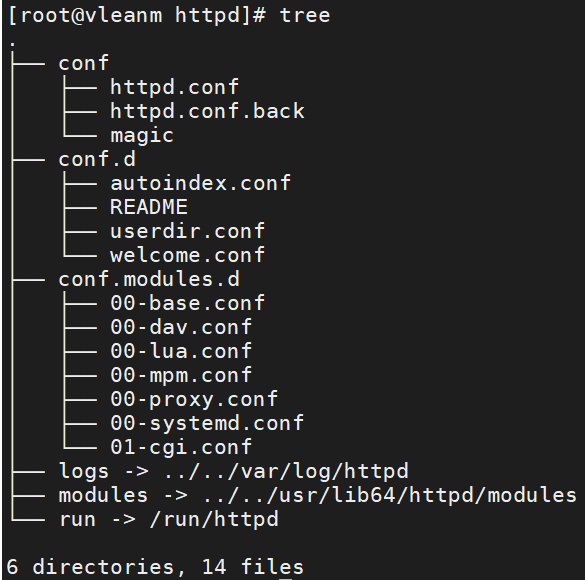

# 安装软件包

```shell
vim /etc/yum.repos.d/base.repo
```

## 配置源仓库

```shell
[base]
name=base
baseurl=file:///mnt
enable=1
gpgcheck=0

or

cd /etc/yum.repos.d/
wget  http://mirrors.aliyun.com/repo/Centos-7.repo
```

## 检查源仓库状态

```powershell
yum repolist
```

## 安装httpd服务

```shell
yum install httpd -y
```

# 启动httpd服务

## 启动服务

```shell
systemctl start httpd
```

## 查看服务状态

```shell
systemctl status httpd
```

# 关闭防火墙（做防火墙准入策略）

## 关闭防火墙
```shell
systemctl stop firewalld
systemctl disable firewalld		(关闭防火墙开机自启)
```
## 防火墙放通80端口
```shell
firewall-cmd --zone=public --add-port=443/tcp --add-port=80/tcp --permanent

参考blog:https://blog.csdn.net/XJ0927/article/details/109607983
```

# 关闭selinux（做selinux准入策略）

## 关闭selinux

```shell
sentenforce 0

vim /etc/selinux/config
	SELINUX=permissive
```
## 做selinux准入策略

```shell

```

# 写入访问文件

```shell
vim /var/www/html/index.html
```

# 6、设置主机访问目录及目录权限



## conf主配置目录

### /etc/httpd/conf/httpd.conf

| 条目                                | 作用                                 |
| ----------------------------------- | ------------------------------------ |
| 31 ServerRoot "/etc/httpd"          | 服务根路径                           |
| 42 Listen 80                        | 监听80端口                           |
| 56 Include conf.modules.d/*.conf    | 包含所有模块配置文件                 |
| 66 User apache<br />67 Group apache | 服务产生的系统用户，为保证系统安全性 |
| 86 ServerAdmin root@localhost       | 服务器管理员                         |
|                                     |                                      |
|                                     |                                      |
|                                     |                                      |
|                                     |                                      |
|                                     |                                      |
|                                     |                                      |
|                                     |                                      |
|                                     |                                      |
|                                     |                                      |
|                                     |                                      |
|                                     |                                      |
|                                     |                                      |
|                                     |                                      |
|                                     |                                      |
|                                     |                                      |
|                                     |                                      |
|                                     |                                      |
|                                     |                                      |
|                                     |                                      |
|                                     |                                      |
|                                     |                                      |
|                                     |                                      |
|                                     |                                      |
|                                     |                                      |
|                                     |                                      |
|                                     |                                      |
|                                     |                                      |
|                                     |                                      |
|                                     |                                      |
|                                     |                                      |
|                                     |                                      |
|                                     |                                      |
|                                     |                                      |
|                                     |                                      |


## conf.d辅助配置目录

## conf.modules.d模块配置目录

7、定义网站资源信息

8、重启服务

\#systemctl restart httpd